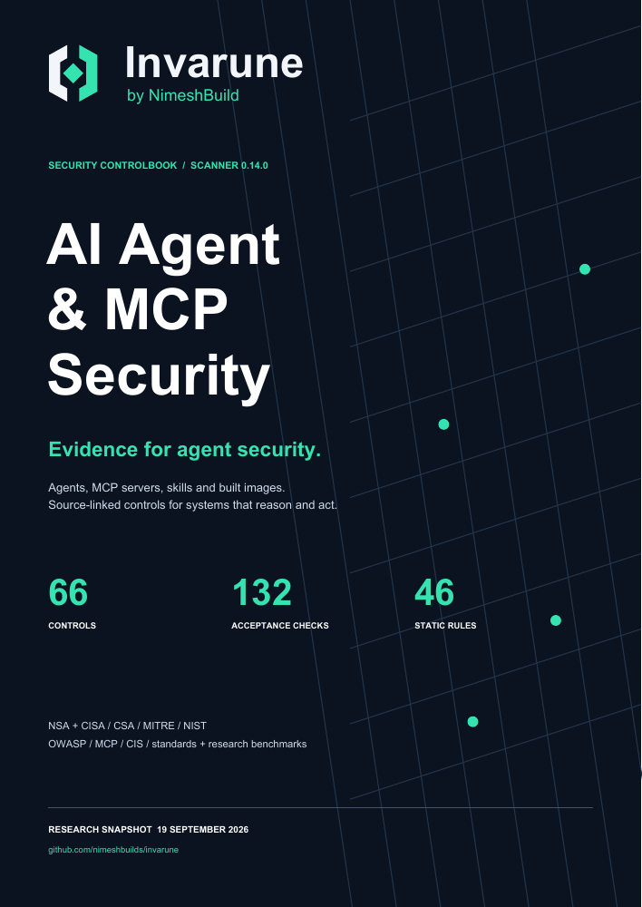

# NimeshBuild | AI Agent & MCP Security

A Python CLI that inspects a codebase or built Linux container image, identifies selected security risks, and produces a detailed report. Source-directory and exported-image archive scans need no Python dependencies; local image references use Docker or Podman. The deterministic scan runs offline and never imports or executes the target application. An optional security analyst reviews every control through a deterministic evidence and validation layer, using native LLM APIs or a custom HTTP gateway. The model's judgment remains nondeterministic and advisory.

The research contains **66 controls and 132 acceptance checks**, informed by NSA/CISA and partner guidance, CSA, NIST, OWASP, MITRE ATLAS, MCP, CIS, ISO, OpenSSF/SLSA, and published agent security benchmarks. **42 deterministic rules provide partial static coverage of 26 controls.** The remaining controls require other evidence. These are project-defined checks, not an official compliance certification.

- [Built image scanning: Docker, Podman and OCI archives](docs/IMAGE_SCANNING.md)
- [Complete CLI reference](docs/CLI.md)
- [Accuracy methodology and known false positives/negatives](docs/RULE_ACCURACY.md)
- [Detailed security checklist](docs/SECURITY_CHECKLIST.md)
- [Research, primary sources, dates, and benchmark comparisons](docs/RESEARCH.md)
- [Judge setup and API compatibility](docs/JUDGE.md)
- [Controlled security analyst: routing, evidence, budgets, and outcomes](docs/ANALYST.md)
- [Machine-readable control catalog](ai_security_scan/data/controls.json)

## The NimeshBuild controlbook

[Download the branded PDF](output/pdf/nimeshbuild-agent-mcp-security-controlbook.pdf): **65 pages**, all **66 controls**, **132 acceptance checks**, **75 primary-source references**, **9 executable research benchmarks**, the **42-rule automation index**, and the controlled analyst workflow. Every control links to source context; the source directory records versions, applicability, drafts, and limitations.

<p align="center"><a href="output/pdf/nimeshbuild-agent-mcp-security-controlbook.pdf"></a></p>

The expanded landscape includes CSA AICM/CCM and MAESTRO, CIS agent/MCP companion guides and the MCP Server benchmark, OWASP AISVS, ISO management/risk standards, software provenance guidance, and agent/MCP attack suites. This is a curated engineering synthesis; it does not reproduce entire proprietary or gated frameworks or claim universal benchmark coverage.

- [Complete source-to-control map](docs/SOURCE_MAP.md)
- [CSA and cloud assurance research](docs/CSA_AND_CLOUD.md)
- [Broader benchmark landscape](docs/BENCHMARK_LANDSCAPE.md)
- [Source registry](ai_security_scan/data/sources.json)
- [PDF build and verification instructions](docs/PUBLISHING.md)

## Run a scan

Requires Python **3.9+**. No packages or API credentials are needed for a static scan. Run from this project's directory:

```sh
python3 scan.py --help
python3 scan.py /absolute/path/to/agent-or-mcp-repo --output ./scan-report
```

`-h` / `--help` includes the complete offline feature reference: every flag/default/range, source and image behavior, exclusions, baselines, reports, optional analyst budgets, all judge JSON fields, gateway configurations, and twenty command examples. The same reference ships in the installed CLI.

To invoke it from any directory, use the absolute path to `scan.py`. You can also install the CLI using `python3 -m pip install .` and run `ai-security-scan`, or use `python3 -m ai_security_scan` from this directory. Installation may need build tooling; direct script execution needs only Python's standard library.

Generated files:

| File | Contents |
|---|---|
| `report.md` | Human-readable findings, file/line evidence, severity, confidence, remediation, source references, all 66 controls, and coverage gaps |
| `report.json` | Structured findings, stable IDs, file hashes, control mappings, suppressions, and optional per-check analyst assessments, evidence excerpts, and request receipts |
| `report.sarif` | SARIF 2.1.0 findings for compatible code-review and CI consumers; runtime/manual checklist details remain in Markdown/JSON |

Exit codes are **0** when the selected scope completes and no unsuppressed finding reaches the chosen threshold, **1** when findings reach the threshold, and **2** for incomplete scanning, configuration/output errors, a requested judge failure, or an incomplete control review. Operational failures take precedence over finding severity. Zero is not proof of security.

```sh
# Gate medium and higher findings; omit one generated directory.
python3 scan.py /path/to/repo --fail-on medium --exclude 'generated/*'

# Produce findings without a severity-based CI failure.
# Incomplete scans and judge failures still return 2.
python3 scan.py /path/to/repo --fail-on none

# Inspect the full rule and control catalogs.
python3 scan.py --list-rules
python3 scan.py --list-controls
```

## Scan a built image without source

```sh
# Existing local image; never starts the container.
python3 scan.py --image my-agent:latest --output ./image-report

# Exported Docker-save or OCI archive; no runtime required.
python3 scan.py --image-archive ./agent-image.tar --output ./image-report

# Podman and explicit registry pulls are also supported.
python3 scan.py --image my-mcp-server:latest --image-runtime podman
python3 scan.py --image ghcr.io/example/agent:1.2.3 --pull
```

Image mode scans packaged supported source, configuration, image metadata, and credentials retained in deleted layers. It inventories OS/packages and stored permission signals. Native binary logic and package CVEs remain explicitly unassessed; a source-free image still receives a clearly labeled metadata report. Optional `--judge-config` adds the same controlled analyst. See [formats, budgets, scope and safety](docs/IMAGE_SCANNING.md).

## Accuracy and CI usage

No static scanner can guarantee zero false positives or false negatives. Our [published accuracy report](benchmarks/accuracy-current.md) includes both passing regression cases and unresolved challenge cases, with all labels and per-rule results available for inspection. A zero-finding result is never a security pass.

```sh
# Machine-readable stdout, with complete reports still saved.
python3 scan.py /path/to/repo --summary-json --fail-on medium --output ./scan-report

# Quiet CI output; operational errors remain visible on stderr.
python3 scan.py /path/to/repo --quiet

# Explain a rule, its references, and mapped controls without scanning.
python3 scan.py --explain-rule AI002

# Run the labeled accuracy corpus without executing its fixture source.
python3 scripts/evaluate_accuracy.py --format markdown
```

## What the scanner checks

| Area | Examples of static signals |
|---|---|
| Agent execution | Dynamic shell commands, eval/exec, generated JavaScript, SQL interpolation, template injection |
| Agent authority | Explicit approval/sandbox bypass, wildcard tool grants, external input in privileged LLM messages |
| MCP configuration | Unpinned server launch packages, insecure remote URLs, explicit authentication bypass, token passthrough |
| Identity and transport | Disabled JWT checks, weak security randomness, disabled TLS verification, wildcard CORS, broad listeners |
| Data and credentials | Embedded credentials/private keys, credentials in URL queries, secret logging, browser credential exposure |
| Files and networks | Obvious external-input paths and URLs, unsafe archive extraction, race-prone temporary names |
| Parsing and models | Unsafe YAML, pickle-compatible loads, explicitly unsafe checkpoint loading |
| Infrastructure and supply chain | Privileged containers, host namespaces/runtime sockets, root users, mutable images/actions/dependencies, download-to-shell |
| Output handling | Unsafe HTML rendering and debug exposure |

Python call checks use AST analysis with bounded local aliases, value tracking, and conservative branch joins. JavaScript/TypeScript uses bounded tokens and balanced calls; JSON uses structured parsing. Other configuration checks remain selected text patterns. Other recognized text types get only applicable generic/configuration rules. Reports state each file’s analysis depth. There is **no whole-program taint analysis**, reachability proof, live MCP probing, dependency CVE lookup, or execution of prompt-injection benchmarks.

The report retains controls for authorization, tenant separation, consent/approval binding, tool poisoning, memory poisoning, supply-chain provenance, resource budgets, observability, and incident response. Static evidence does not establish these controls as passing. `no_pattern_detected` is explicitly different from a control pass; `findings_detected` means investigate, not automatic noncompliance. `findings_suppressed` means matching findings were accepted in an explicit baseline; it does not mean no risk pattern exists.

## Optional controlled security analyst

The judge is disabled by default. Native adapters support **OpenAI-compatible Chat Completions, OpenAI Responses, Anthropic Messages, Gemini GenerateContent, and Ollama Chat**. Every adapter accepts an exact custom endpoint URL. A **custom JSON request template and response-path adapter** covers other HTTP APIs and gateways. Native cloud request signing, OAuth token refresh, gRPC, and streaming-only protocols require an appropriate gateway or additional adapter; accepting arbitrary URLs does not mean every proprietary API works unchanged.

Create a trusted JSON configuration, for example:

```json
{
  "provider": "openai_chat",
  "model": "YOUR_GATEWAY_MODEL_ID",
  "endpoint": "https://gateway.example.com/v1/chat/completions",
  "api_key_env": "SECURITY_JUDGE_API_KEY",
  "timeout_seconds": 60,
  "max_output_tokens": 4096
}
```

Set `SECURITY_JUDGE_API_KEY` using your shell or secret manager, then:

```sh
python3 scan.py /path/to/repo --judge-config ./judge.json --output ./scan-report

# Increase the scheduling budget for slower models.
python3 scan.py /path/to/repo --judge-config ./judge.json --analyst-time-budget 600

# Narrow opt-in: finding triage only, without the all-control source review.
python3 scan.py /path/to/repo --judge-config ./judge.json --judge-mode findings
```

With `--judge-config`, **full review is the default**: one finding-triage request followed by all **66 controls / 132 checks**, including those with no findings. Even mapped static rules cannot establish a complete control pass, so every control is queued. A deterministic selector gathers bounded, redacted excerpts from unchanged files in the scan manifest. The model cannot choose files, execute code, use tools, change findings, or authorize actions.

The controller validates a strict per-check schema, known IDs, and exact source quotes. Each check receives `supported_by_code`, `potential_gap`, `needs_runtime_validation`, `needs_human_review`, `insufficient_evidence`, or `not_applicable_proposed`. These are advisory outcomes. Manual and dynamic controls cannot be established by code support; runtime and owner verification stay open. Unsupported claims, fabricated citations, unknown IDs, and tool calls fail the batch. Missing answers stay explicitly unreviewed.

Default control-review budgets are **12 requests**, **6 controls per request**, **180 seconds** for scheduling and per-request timeouts, and evidence from at most **200 files / 2 MB**, with **240 excerpts / 120,000 characters** overall and at most four excerpts per control. A normal complete catalog uses 11 control requests plus one finding-triage request. Time is not a hard process deadline. Budget exhaustion, omitted answers, or a failed batch preserves all results and returns **2**. A completed review can still contain unresolved runtime, human, or evidence requirements. See [all limits and coverage semantics](docs/ANALYST.md).

**Full mode sends bounded source excerpts even when no findings exist.** `--judge-mode findings` retains one-request triage: up to 100 unsuppressed findings and their redacted evidence, summary, and limitations. `--judge-max-findings` accepts 1–500. `--judge-include-source` adds neighboring source only to that triage request, capped at seven lines / 3,000 characters per excerpt and 30,000 total; it is independent of full-mode evidence. Credential files are excluded from analyst excerpts, and all omissions are reported. The source selector is partial retrieval, not a complete semantic review of the repository.

Redaction is best-effort and does not remove all confidential information. Review the local JSON report before choosing an external judge endpoint. API credentials come from explicitly named environment variables, are sent only to the configured endpoint, and are not written to reports. TLS verification stays enabled; private CAs are supported. Redirects and implicit environment proxies are disabled. Remote plaintext HTTP requires an explicit insecure configuration opt-in.

Judge output is nondeterministic, including with deterministic-looking model settings. It cannot suppress findings, downgrade deterministic severity, mark controls as passing, or alter the severity gate. Markdown places advice beside each acceptance check; JSON retains evidence hashes, citations, omissions, and request receipts. SARIF remains static findings only. See [the complete adapter guide](docs/JUDGE.md) and [example configurations](examples/judges/). Version 0.2 changes configured review from finding-only to full by default; use `--judge-mode findings` for the previous outbound-data scope.

## Scope, limits, and reproducibility

- Default limits: 1 MB per file, 50 MB source I/O budget, 20,000 scanned files, 100,000 filesystem entries. Override with `--max-file-bytes`, `--max-total-bytes`, `--max-files`, and `--max-entries`. Reads reserve one sentinel byte for growth detection. Returned bytes count even when the opened file's identity is rejected; failed reads conservatively charge their maximum possible size. Reports distinguish actual returned bytes from charged bytes. A file that exactly fills the remaining budget can therefore require one more byte of allowance.
- Common dependency/build directories are excluded, including `.git`, `node_modules`, `vendor`, `.venv`, `venv`, `dist`, `build`, and caches. Other default exclusions are recorded in each report. Scan a dependency or built artifact separately when it needs review.
- User exclusions and unsupported extensions are outside the selected scope. Symlinks, unreadable files, malformed Python/JSON, oversized/binary/non-UTF-8 recognized files, empty scope, and resource limits produce visible coverage gaps. Rules do not follow symlinks or open special devices intentionally.
- Additional `--exclude` patterns match relative paths using Python `fnmatch` semantics (`*` can span `/`), rather than `.gitignore` semantics. Tests and examples are included unless explicitly excluded; validate their findings in context.
- The configured output directory, baseline files, and judge configuration are excluded from source analysis. Keep prior reports in the same output directory or exclude other report directories explicitly.
- Deterministic reports contain no wall-clock timestamps. Stable input content, relative paths, rule/control catalog, scanner/Python version, settings, baseline, and filesystem availability produce repeatable static output. IDs use rule, path, line, and evidence; moving code can change them. Optional LLM output is outside this guarantee.
- Scan a stable checkout. On systems with directory-descriptor support, every source path component is opened relative to verified directory handles with symlink following disabled. Other platforms use a best-effort path check. Concurrent edits can still produce a mixed content snapshot; this tool is not an OS-level sandbox. Use a disposable restricted environment for actively malicious repositories.
- Output files use restrictive temporary-file permissions and atomic replacement. They can still contain sensitive source fragments and paths; handle them as security artifacts.

## Baselines for reviewed exceptions

Baselines preserve findings in the report but remove accepted IDs from the severity gate. They must be intentionally supplied. A baseline candidate does not suppress the scan that creates it.

```sh
python3 scan.py /path/to/repo --write-baseline ./baseline.json \
  --baseline-reason 'Reviewed exception; owner and expiry tracked in SEC-123'

# Review the candidate file before using it in CI.
python3 scan.py /path/to/repo --baseline ./baseline.json
```

Each entry requires a nonempty reason. The CLI candidate includes all current findings with the shared reason; remove unaccepted entries and make reasons specific. Stale IDs are reported. Approval, expiry, and compensating controls are human responsibilities, not inferred from the text. No source comment can silently disable a rule.

## Try the included fixtures and tests

```sh
# Deliberately vulnerable source; scan it, do not run it.
python3 scan.py examples/vulnerable --output ./test-output/vulnerable --fail-on none

# Small safer comparison fixture, not a complete secure application.
python3 scan.py examples/safer --output ./test-output/safer

# Includes mocked API adapters and a loopback HTTP transport test; no paid API calls.
python3 -m unittest discover -s tests -v
```

[Validation evidence](docs/VALIDATION.md) and the [scenario test matrix](docs/TEST_MATRIX.md) record the tests, real local HTTP/TLS exercises, package checks, coverage, platform results, and remaining gaps. Sample reports are provided under [examples/reports](examples/reports/).

Research benchmarks such as AgentDojo, InjecAgent, Agent Security Bench, and MCPSecBench should be run separately in a controlled harness against your configured agent. The [research guide](docs/RESEARCH.md) explains what they measure and how to combine them with source findings and deployment tests.
