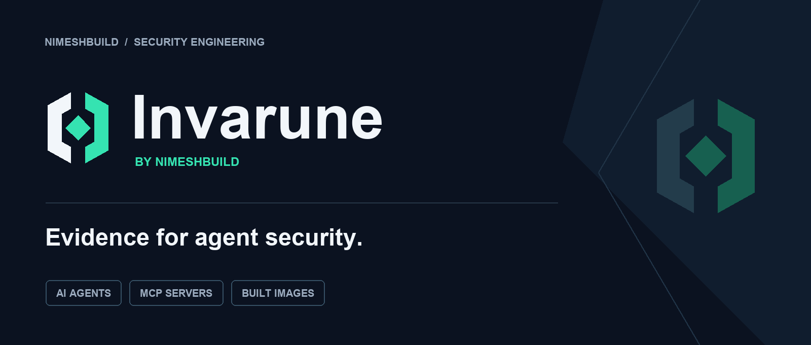
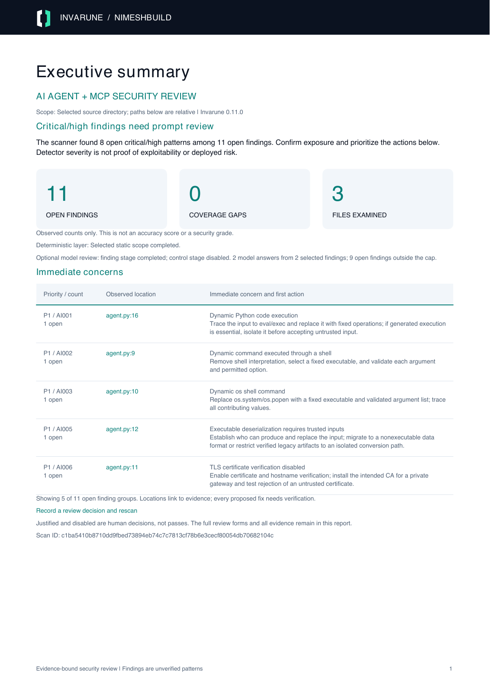

# Invarune by NimeshBuild



**Invarune** (IN-vuh-roon) provides the `invscan` CLI to inspect a codebase or built Linux container image, identify selected security risks, and produce a detailed report. Source-directory and exported-image archive scans need no Python dependencies; local image references use Docker or Podman. The deterministic scan runs offline and never imports or executes the target application. An optional security analyst reviews every active control through a deterministic evidence and validation layer, using native LLM APIs, a custom HTTP gateway, or an official Codex, Claude Code or Grok Build CLI. The model's judgment remains nondeterministic and advisory.

The research contains **66 controls and 132 acceptance checks**, informed by NSA/CISA and partner guidance, CSA, NIST, OWASP, MITRE ATLAS, MCP, CIS, ISO, OpenSSF/SLSA, and published agent security benchmarks. **42 deterministic rules provide partial static coverage of 26 controls.** The remaining controls require other evidence. These are project-defined checks, not an official compliance certification.

- **[Quick start: install and use invscan](docs/QUICKSTART.md)**
- **[Ask about security controls offline](docs/SECURITY_EXPLORER.md)**
- **[Download the v0.12 CLI wheel and explorer examples](https://github.com/nimeshbuilds/agent-mcp-security/releases/tag/v0.12.0)**
- **[New v0.11 scan report: fillable PDF, HTML and live AI example](examples/reports/invscan-v011/README.md)**
- [Edit a report, record justifications and scan again](docs/REVIEW_WORKFLOW.md)
- [Actual five-format source/image review examples](examples/reports/review-workflow/README.md)
- [Built image scanning: Docker, Podman and OCI archives](docs/IMAGE_SCANNING.md)
- [Complete CLI reference](docs/CLI.md)
- [Justified and disabled checks: review configuration](docs/REVIEW_CONFIGURATION.md)
- [Accuracy methodology and known false positives/negatives](docs/RULE_ACCURACY.md)
- [Fresh finding-by-finding competitor comparison](benchmarks/comparison-v010/README.md)
- [Executed quickstart validation and receipts](benchmarks/quickstart-v012/README.md)
- [Real-project reports and comparative scanner benchmark](docs/BENCHMARK_RESULTS.md)
- [CLI subscription login, model defaults and live-test evidence](docs/CLI_PROVIDER_RESEARCH.md)
- [Detailed security checklist](docs/SECURITY_CHECKLIST.md)
- [Research, primary sources, dates, and benchmark comparisons](docs/RESEARCH.md)
- [Judge setup and API compatibility](docs/JUDGE.md)
- [Controlled security analyst: routing, evidence, budgets, and outcomes](docs/ANALYST.md)
- [Machine-readable control catalog](ai_security_scan/data/controls.json)

## Ask what the security checks cover

```sh
invscan --list-topics
invscan --ask 'What do you check for prompt injection?'
invscan --ask 'How is MCP authentication covered?'
invscan --ask 'What NSA and CISA guidance do you use?'
invscan --explain-control AUTH-01
invscan --explain-check AUTH-01:1
invscan --list-sources
invscan --explain-source JOINT-AGENTIC
invscan --explain-control AUTH-01 --catalog-format json
```

These commands read the bundled catalog only. `--ask` is bounded deterministic token/alias lookup, not generative chat or a scan of your system. Answers explain why each control matters, its acceptance checks, partial static mappings, source organizations and validation limits. Primary control citations, thematic alignments and technical rule references remain distinct. The 42 rules still map partially to 26 controls; an explanation does not establish that a check passes.

New explorer commands default to readable text. The existing `--list-rules`, `--list-controls` and `--explain-rule` retain their JSON defaults; `--catalog-format text` requests a readable view. No model or login is enabled. [Complete explorer guide](docs/SECURITY_EXPLORER.md), or run `invscan --help-topic security`.

[Read actual installed CLI answers](examples/security-explorer/README.md). Version 0.12 passed **793 local tests**, a **53-step fresh-install quickstart**, and **all eight cross-platform CI jobs**. The released wheel was downloaded back, hash-verified and installed in another fresh environment. [Validation receipts](benchmarks/validation-v012/README.md).

## Latest scan report

[Open the redesigned scan report](examples/reports/invscan-v011/README.md): priorities and linked locations at the beginning, findings from page 4, concrete fixes and mitigating layers, readable scope/configuration/AI coverage, Headroom byte receipts, and editable justifications with an audit appendix. The actual example uses installed `invscan`, limited live Codex review and default Headroom. Its 2 selected finding answers, 9 unselected findings and unrequested control review are explicit.

<p align="center"><a href="examples/reports/invscan-v011/report.pdf"></a></p>

That v0.11 report's [43-step quickstart receipt](benchmarks/quickstart-v011/README.md), [765-test validation evidence](benchmarks/validation-v011/README.md) and [eight successful CI jobs](https://github.com/nimeshbuilds/agent-mcp-security/actions/runs/35479443718) remain historical evidence. The v0.12 explorer does not change report rendering or detectors. The controlbook below is the separate research/control reference.

## The Invarune controlbook

[Download the branded PDF](output/pdf/invarune-security-controlbook.pdf): **71 pages**, all **66 controls**, **132 acceptance checks**, **75 primary-source references**, **9 executable research benchmarks**, the **42-rule automation index**, and the controlled analyst workflow. Every control links to source context; the source directory records versions, applicability, drafts, and limitations.

<p align="center"><a href="output/pdf/invarune-security-controlbook.pdf"></a></p>

The expanded landscape includes CSA AICM/CCM and MAESTRO, CIS agent/MCP companion guides and the MCP Server benchmark, OWASP AISVS, ISO management/risk standards, software provenance guidance, and agent/MCP attack suites. This is a curated engineering synthesis; it does not reproduce entire proprietary or gated frameworks or claim universal benchmark coverage.

- [Complete source-to-control map](docs/SOURCE_MAP.md)
- [CSA and cloud assurance research](docs/CSA_AND_CLOUD.md)
- [Broader benchmark landscape](docs/BENCHMARK_LANDSCAPE.md)
- [Source registry](ai_security_scan/data/sources.json)
- [PDF build and verification instructions](docs/PUBLISHING.md)

## Run a scan

Install once, then use **`invscan`** from any directory. From this checkout, create and activate an isolated environment (Python **3.9+**):

```sh
python3 -m venv .venv
. .venv/bin/activate
pip install .
invscan --help
invscan --examples
invscan /absolute/path/to/agent-or-mcp-repo --output ./scan-report
invscan --image-archive ./agent-image.tar --output ./image-report
```

On Windows PowerShell, create the environment with `py -3 -m venv .venv` and add its command directory to this terminal with `$env:Path = "$((Resolve-Path .venv\Scripts).Path);$env:Path"`. The subsequent `pip` and `invscan` commands are the same. [Quickstart](docs/QUICKSTART.md) includes a route without activation.

For AI review with Headroom and fillable PDFs, use Python **3.10+** and install the optional features into that same environment:

```sh
pip install '.[ai,pdf]'
invscan ./my-agent --judge-cli codex --pdf --output ./review
invscan --help-topic ai
invscan --help-topic review
```

`-h` / `--help` includes the complete offline reference: every flag/default/range, source and image behavior, exclusions, baselines, reports, analyst budgets, login/model choices, all judge JSON fields, gateway configurations and examples. `--help-topic` provides focused guides, and `--examples` gives copyable recipes. None of these help commands scan files, read provider configuration, log in or call a service.

`invarune` and `ai-security-scan` remain compatible aliases of `invscan`. Direct `scan.py` and module invocation remain available for existing users. The distribution name `agent-mcp-security-scan`, report machine identifiers and repository URL stay stable. See the [brand kit](docs/BRAND.md).

[View the sample Markdown report](examples/reports/v011/source/report.md) or [download the sample HTML report](examples/reports/v011/source/report.html?raw=1) and open it locally. These are deliberately vulnerable fixtures, not a production assessment.

For real testing, see the [eight pinned public-project reports](benchmarks/real-world/README.md), the [external scanner comparison](benchmarks/external-tools/README.md), and the [branded benchmark PDF](output/pdf/invarune-benchmark-report.pdf). The same selected source bytes were offered to Invarune, Semgrep CE, Bandit and Gitleaks. Cisco MCP Scanner ran a separate partial metadata test. Findings, false-positive examples, parser gaps, commands, versions and hashes are published; observed counts are not confirmed vulnerabilities or a scanner ranking.

Version **0.12.0** adds an offline security explorer: ask what the catalog checks, why a control matters and where its guidance came from. It explains all controls and checks without a target, model, login or network request. Install the [released 0.12.0 wheel](https://github.com/nimeshbuilds/agent-mcp-security/releases/tag/v0.12.0) or the current checkout for these commands.

Version **0.11.0** made `invscan` the primary command, added topic help and an example gallery, and brought findings/action links to the front of the scan PDF. Optional AI review defaults to guarded Headroom JSON compaction, with exact evidence preservation and a visible built-in fallback. [Headroom research and measured limits](docs/HEADROOM_RESEARCH.md).

Version **0.10.0** added a sourced fix plan for every deterministic finding: agent/MCP relevance, applicability, concrete implementation changes, verification steps and remaining risk. The optional model can supply its own structured advice; missing model advice stays visible and cannot replace the static plan. [Guidance catalog](ai_security_scan/data/remediations.json), [report interpretation](docs/REPORTS.md).

The [fresh comparison](benchmarks/comparison-v010/README.md) and [13-page branded comparison PDF](output/pdf/invarune-finding-comparison-v010.pdf) publish every observed finding, shared and tool-only matches, execution gaps and a predefined adjudication sample. Its fixture-label results and any model judgments remain separate from confirmed production vulnerabilities. The [Claude-enabled example](examples/reports/cli-claude-v010/README.md) records the actual authentication failure; the [limited live Codex example](examples/reports/cli-codex-v010/README.md) demonstrates structured fix advice.

Generated files:

| File | Contents |
|---|---|
| `report.html` | Branded, standalone report with an executive summary, immediate concerns, grouped findings, proposed defense layers, verification steps, residual limits, source references, and full technical evidence; open it locally without a server or internet connection |
| `report.md` | Portable executive summary and action plan followed by findings, file/line evidence, severity, confidence, remediation, all 66 controls, and coverage gaps |
| `report.json` | The same deterministic assessment in structured form, plus stable finding IDs, file hashes, control mappings, suppressions, and optional per-check analyst assessments, evidence excerpts, and request receipts |
| `report.sarif` | SARIF 2.1.0 findings for compatible code-review and CI consumers; runtime/manual checklist details remain in Markdown/JSON |
| `report.pdf` (with `--pdf`) | Branded fillable scan report with charts, clickable contents, coverage explanations and user review fields; requires the optional `pdf` extra |

Reports within the documented review-size limits contain editable review data. Fill the HTML or PDF form, or edit the designated JSON fields in Markdown/JSON/SARIF, then pass the saved file to a fresh scan. User justifications stay distinct from validated passes; changed evidence and pending runtime validation remain explicit. If the complete review workspace cannot be exported, static reports remain available with an explicit error and exit 2.

```sh
python3 -m pip install '.[pdf]'
invscan /path/to/repo --pdf --output ./initial-report
invscan /path/to/repo --review-report ./reviewed-report.html --pdf --output ./final-report
```

Use the HTML **Download reviewed HTML** button to preserve form edits. Keep reports outside the source target and select the fresh code/image input explicitly. [Complete five-format review workflow](docs/REVIEW_WORKFLOW.md).

The report starts with what was found and what needs attention first. It groups repeated findings by rule, status, and image context, and distinguishes open concerns from accepted baseline exceptions. Critical/high findings lead the action plan; proposed layers such as isolation, scoped authorization, egress restrictions, approval checks, and monitoring include verification work and remaining limitations. A proposed layer is never treated as already deployed or used to lower the detected severity. The summary and action plan are generated without a model; optional advisory review remains separate. See the [report guide](docs/REPORTS.md) for interpretation and mitigation verification.

Exit codes are **0** when the selected scope completes and no open finding reaches the chosen threshold, **1** when findings reach the threshold, and **2** for incomplete scanning, configuration/output errors, a requested judge failure, or an incomplete control review. Operational failures take precedence over finding severity. Zero is not proof of security.

```sh
# Gate medium and higher findings; omit one generated directory.
invscan /path/to/repo --fail-on medium --exclude 'generated/*'

# Produce findings without a severity-based CI failure.
# Incomplete scans and judge failures still return 2.
invscan /path/to/repo --fail-on none

# Inspect the full rule and control catalogs.
invscan --list-rules
invscan --list-controls
```

## Justify or disable selected checks

Use `--review-config ./trusted-review.json` with a source directory or image input. Rules, whole controls, and individual `CONTROL:INDEX` checklist items can be marked **justified** or **disabled**. Justification requires your reason. Both statuses are excluded from active counts, and rule exceptions are excluded from the findings gate; neither counts as a pass. Evidence and your reason remain in the reports. Checklist exceptions do not automatically waive mapped rule findings, and errors or coverage gaps still return exit 2.

```sh
invscan /path/to/repo --review-config ./trusted-review.json --output ./scan-report
```

See the [complete schema, precedence and examples](docs/REVIEW_CONFIGURATION.md) and [illustrative configuration](examples/review-config.json) and [report with justified/disabled items](examples/reports/reviewed/report.md). The scanner never auto-loads a policy from the target repository. No numerical security score is calculated.

## Scan a built image without source

```sh
# Existing local image; never starts the container.
invscan --image my-agent:latest --output ./image-report

# Exported Docker-save or OCI archive; no runtime required.
invscan --image-archive ./agent-image.tar --output ./image-report

# Podman and explicit registry pulls are also supported.
invscan --image my-mcp-server:latest --image-runtime podman
invscan --image ghcr.io/example/agent:1.2.3 --pull
```

Image mode scans packaged supported source, configuration, image metadata, and credentials retained in deleted layers. It inventories OS/packages and stored permission signals. Native binary logic and package CVEs remain explicitly unassessed; a source-free image still receives a clearly labeled metadata report. Optional `--judge-config` adds the same controlled analyst. See [formats, budgets, scope and safety](docs/IMAGE_SCANNING.md).

## Accuracy and CI usage

No static scanner can guarantee zero false positives or false negatives. Our [published accuracy report](benchmarks/accuracy-current.md) includes both passing regression cases and unresolved challenge cases, with all labels and per-rule results available for inspection. A zero-finding result is never a security pass.

```sh
# Machine-readable stdout, with complete reports still saved.
invscan /path/to/repo --summary-json --fail-on medium --output ./scan-report

# Quiet CI output; operational errors remain visible on stderr.
invscan /path/to/repo --quiet

# Explain a rule, its references, and mapped controls without scanning.
invscan --explain-rule AI002

# Run the labeled accuracy corpus without executing its fixture source.
python3 scripts/evaluate_accuracy.py --format markdown
```

## What the scanner checks

| Area | Examples of static signals |
|---|---|
| Agent execution | Dynamic shell commands, eval/exec, generated JavaScript, SQL interpolation, template injection |
| Agent authority | Explicit approval/sandbox bypass, wildcard tool grants, external input in privileged LLM messages |
| MCP configuration | Unpinned server launch packages, insecure remote URLs, explicit authentication bypass, token passthrough |
| Identity and transport | Disabled JWT checks, weak security randomness, disabled TLS verification, wildcard CORS, broad listeners |
| Data and credentials | Embedded credentials/private keys, credentials in URL queries, secret logging, browser credential exposure |
| Files and networks | Obvious external-input paths and URLs, unsafe archive extraction, race-prone temporary names |
| Parsing and models | Unsafe YAML, pickle-compatible loads, explicitly unsafe checkpoint loading |
| Infrastructure and supply chain | Privileged containers, host namespaces/runtime sockets, root users, mutable images/actions/dependencies, download-to-shell |
| Output handling | Unsafe HTML rendering and debug exposure |

Python call checks use AST analysis with bounded local aliases, value tracking, and conservative branch joins. JavaScript/TypeScript uses bounded tokens and balanced calls; JSON uses structured parsing. Other configuration checks remain selected text patterns. Other recognized text types get only applicable generic/configuration rules. Reports state each file’s analysis depth. There is **no whole-program taint analysis**, reachability proof, live MCP probing, dependency CVE lookup, or execution of prompt-injection benchmarks.

The report retains controls for authorization, tenant separation, consent/approval binding, tool poisoning, memory poisoning, supply-chain provenance, resource budgets, observability, and incident response. Static evidence does not establish these controls as passing. `no_pattern_detected` is explicitly different from a control pass; `findings_detected` means investigate, not automatic noncompliance. `findings_suppressed` means matching findings were accepted in an explicit baseline; it does not mean no risk pattern exists.

## Optional controlled security analyst

Use an existing official CLI subscription login, with no separate API key configured in Invarune:

```sh
invscan /path/to/repo --judge-cli codex
invscan /path/to/repo --judge-cli claude
invscan /path/to/repo --judge-cli grok

# Sign in directly through Invarune without scanning:
invscan --login claude

# Unattended runs never prompt for login:
invscan /path/to/repo --judge-cli codex --judge-login never --summary-json
```

Interactive scans launch the official login when needed and resume automatically. Cancellation or failure preserves deterministic reports. Invarune selects **`gpt-6-astra`**, **`opus`**, or **`grok-build`** as its respective security-review defaults; `--judge-model` overrides that choice. These are documented quality-focused defaults, not an independently measured model ranking. Vendor account/model access and usage limits apply. The CLI must already be installed; Invarune does not purchase credits or install/update it implicitly.

CLI inference runs with restricted capabilities in a private working directory. Grok profiles with active extensions or external instructions are rejected before inference; `--judge-cli-home` can select a dedicated Grok profile. These restrictions do not provide complete OS isolation. See [official CLI research, requirements and live-test limitations](docs/CLI_PROVIDER_RESEARCH.md) and [complete setup](docs/JUDGE.md).

The judge is disabled by default. Native adapters support **OpenAI-compatible Chat Completions, OpenAI Responses, Anthropic Messages, Gemini GenerateContent, and Ollama Chat**. Every adapter accepts an exact custom endpoint URL. A **custom JSON request template and response-path adapter** covers other HTTP APIs and gateways. Native cloud request signing, OAuth token refresh, gRPC, and streaming-only protocols require an appropriate gateway or additional adapter; accepting arbitrary URLs does not mean every proprietary API works unchanged.

Create a trusted JSON configuration, for example:

```json
{
  "provider": "openai_chat",
  "model": "YOUR_GATEWAY_MODEL_ID",
  "endpoint": "https://gateway.example.com/v1/chat/completions",
  "api_key_env": "SECURITY_JUDGE_API_KEY",
  "timeout_seconds": 60,
  "max_output_tokens": 4096
}
```

Set `SECURITY_JUDGE_API_KEY` using your shell or secret manager, then:

```sh
invscan /path/to/repo --judge-config ./judge.json --output ./scan-report

# Increase the scheduling budget for slower models.
invscan /path/to/repo --judge-config ./judge.json --analyst-time-budget 600

# Narrow opt-in: finding triage only, without the all-control source review.
invscan /path/to/repo --judge-config ./judge.json --judge-mode findings
```

With `--judge-config` or `--judge-cli`, **full review is the default**: one finding-triage request followed by the active checks from **66 controls / 132 checks**, including those with no findings. Even mapped static rules cannot establish a complete control pass, so every active control is queued. Explicit user dispositions in `--review-config` exclude named checklist items from that queue and its denominator; the original catalog remains visible for audit. A deterministic selector gathers bounded, redacted excerpts from unchanged files in the scan manifest. The model cannot choose files, execute code, use tools, change findings, or authorize actions.

The controller validates a strict per-check schema, known IDs, and exact source quotes. Each active check receives `supported_by_code`, `potential_gap`, `needs_runtime_validation`, `needs_human_review`, `insufficient_evidence`, or `not_applicable_proposed`. These are advisory outcomes. Manual and dynamic controls cannot be established by code support; runtime and owner verification stay open. Unsupported claims, fabricated citations, unknown IDs, and tool calls fail the batch. Missing answers stay explicitly unreviewed.

Default control-review budgets are **12 requests**, **6 controls per request**, **180 seconds** for scheduling and per-request timeouts, and evidence from at most **200 files / 2 MB**, with **240 excerpts / 120,000 characters** overall and at most four excerpts per control. A normal complete catalog uses 11 control requests plus one finding-triage request. Time is not a hard process deadline. Budget exhaustion, omitted answers, or a failed batch preserves all results and returns **2**. A completed review can still contain unresolved runtime, human, or evidence requirements. See [all limits and coverage semantics](docs/ANALYST.md).

**When active checks remain, full mode sends bounded source excerpts even when no findings exist.** `--judge-mode findings` retains one-request triage: up to 100 open findings and their redacted evidence, summary, and limitations. `--judge-max-findings` accepts 1–500. `--judge-include-source` adds neighboring source only to that triage request, capped at seven lines / 3,000 characters per excerpt and 30,000 total; it is independent of full-mode evidence. Credential files are excluded from analyst excerpts, and all omissions are reported. The source selector is partial retrieval, not a complete semantic review of the repository.

Redaction is best-effort and does not remove all confidential information. Review the local JSON report before choosing an external judge endpoint. API credentials come from explicitly named environment variables, are sent only to the configured endpoint, and are not written to reports. TLS verification stays enabled; private CAs are supported. Redirects and implicit environment proxies are disabled. Remote plaintext HTTP requires an explicit insecure configuration opt-in.

Judge output is nondeterministic, including with deterministic-looking model settings. It cannot suppress findings, downgrade deterministic severity, mark controls as passing, or alter the severity gate. HTML and Markdown place advice beside each acceptance check; JSON retains evidence hashes, citations, omissions, and request receipts. SARIF remains static findings only. See [the complete adapter guide](docs/JUDGE.md) and [example configurations](examples/judges/). Version 0.2 changes configured review from finding-only to full by default; use `--judge-mode findings` for the previous outbound-data scope.

## Scope, limits, and reproducibility

- Default limits: 1 MB per file, 50 MB source I/O budget, 20,000 scanned files, 100,000 filesystem entries. Override with `--max-file-bytes`, `--max-total-bytes`, `--max-files`, and `--max-entries`. Reads reserve one sentinel byte for growth detection. Returned bytes count even when the opened file's identity is rejected; failed reads conservatively charge their maximum possible size. Reports distinguish actual returned bytes from charged bytes. A file that exactly fills the remaining budget can therefore require one more byte of allowance.
- Common dependency/build directories are excluded, including `.git`, `node_modules`, `vendor`, `.venv`, `venv`, `dist`, `build`, and caches. Other default exclusions are recorded in each report. Scan a dependency or built artifact separately when it needs review.
- User exclusions and unsupported extensions are outside the selected scope. Symlinks, unreadable files, malformed Python/JSON, oversized/binary/non-UTF-8 recognized files, empty scope, and resource limits produce visible coverage gaps. Rules do not follow symlinks or open special devices intentionally.
- Additional `--exclude` patterns match relative paths using Python `fnmatch` semantics (`*` can span `/`), rather than `.gitignore` semantics. Tests and examples are included unless explicitly excluded; validate their findings in context.
- The configured output directory, baseline files, and judge configuration are excluded from source analysis. Keep prior reports in the same output directory or exclude other report directories explicitly.
- Deterministic reports contain no wall-clock timestamps. Stable input content, relative paths, rule/control catalog, scanner/Python version, settings, baseline, and filesystem availability produce repeatable static output. IDs use rule, path, line, and evidence; moving code can change them. Optional LLM output is outside this guarantee.
- Scan a stable checkout. On systems with directory-descriptor support, every source path component is opened relative to verified directory handles with symlink following disabled. Other platforms use a best-effort path check. Concurrent edits can still produce a mixed content snapshot; this tool is not an OS-level sandbox. Use a disposable restricted environment for actively malicious repositories.
- Output files use restrictive temporary-file permissions and atomic replacement. They can still contain sensitive source fragments and paths; handle them as security artifacts.

## Baselines for reviewed exceptions

Baselines preserve findings in the report but remove accepted IDs from the severity gate. They must be intentionally supplied. A baseline candidate does not suppress the scan that creates it.

```sh
invscan /path/to/repo --write-baseline ./baseline.json \
  --baseline-reason 'Reviewed exception; owner and expiry tracked in SEC-123'

# Review the candidate file before using it in CI.
invscan /path/to/repo --baseline ./baseline.json
```

Each entry requires a nonempty reason. The CLI candidate includes all current findings with the shared reason; remove unaccepted entries and make reasons specific. Stale IDs are reported. Approval, expiry, and compensating controls are human responsibilities, not inferred from the text. No source comment can silently disable a rule.

## Try the included fixtures and tests

```sh
# Deliberately vulnerable source; scan it, do not run it.
invscan examples/vulnerable --output ./test-output/vulnerable --fail-on none

# Small safer comparison fixture, not a complete secure application.
invscan examples/safer --output ./test-output/safer

# Includes mocked API adapters and a loopback HTTP transport test; no paid API calls.
python3 -m unittest discover -s tests -v
```

[Validation evidence](docs/VALIDATION.md) and the [scenario test matrix](docs/TEST_MATRIX.md) record the tests, real local HTTP/TLS exercises, package checks, coverage, platform results, and remaining gaps. Sample reports are provided under [examples/reports](examples/reports/).

Research benchmarks such as AgentDojo, InjecAgent, Agent Security Bench, and MCPSecBench should be run separately in a controlled harness against your configured agent. The [research guide](docs/RESEARCH.md) explains what they measure and how to combine them with source findings and deployment tests.
