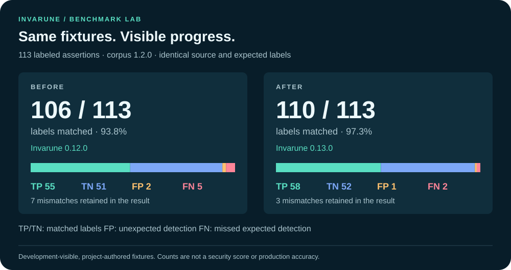
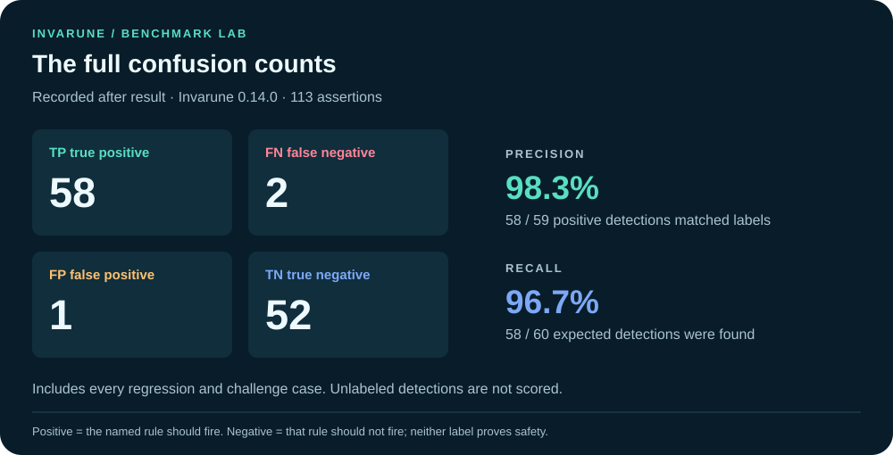
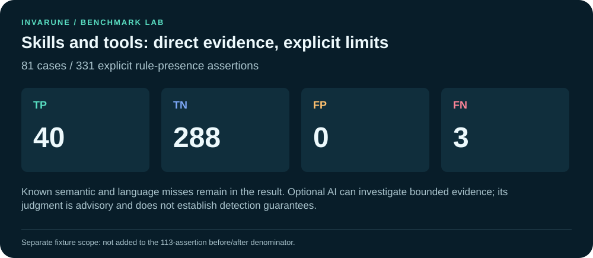
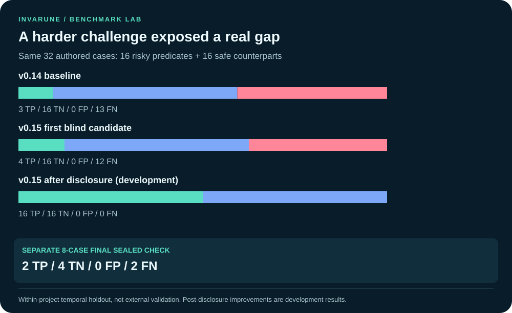
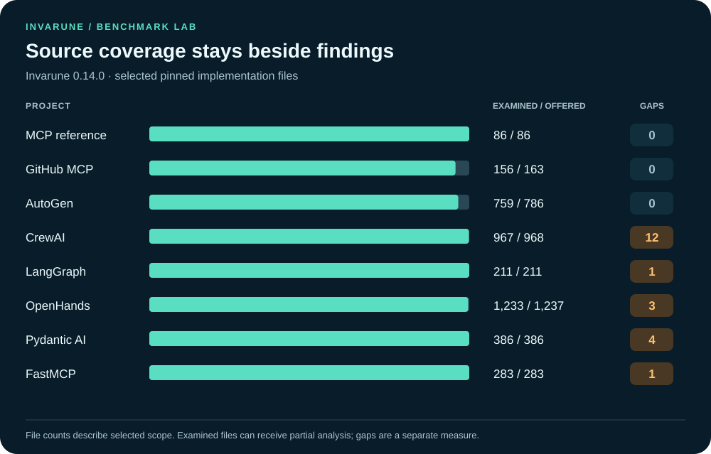
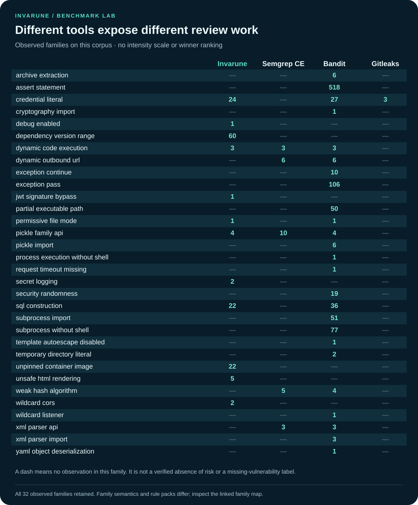
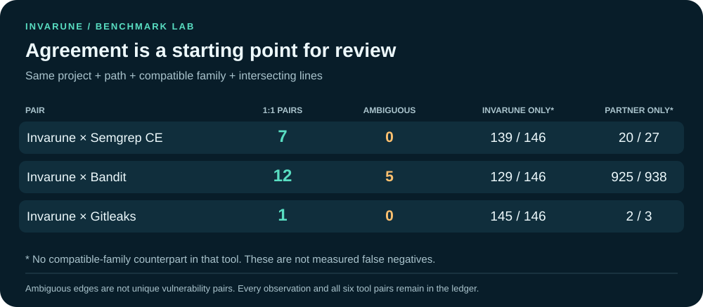

<div class="ivb-dashboard" markdown>

<div class="ivb-hero" markdown>
<p class="ivb-kicker">INVARUNE BY NIMESHBUILD · BENCHMARK LAB</p>

# Know what changed. See what needs review.

Explore measured fixture outcomes, pinned source coverage and complementary scanner observations. Every chart links back to the recorded evidence; no chart is a production security score.

[Fixture progress](#fixture-progress){ .md-button .md-button--primary }
[Compare review surfaces](#complementary-review-surfaces){ .md-button }
[Read the method](BENCHMARK_GUIDE.md){ .md-button }

[Download the benchmark PDF](../output/pdf/invarune-benchmark-v015.pdf){ .md-button }


<div class="ivb-stats">
<div class="ivb-stat"><strong>8</strong><span>pinned public projects</span></div>
<div class="ivb-stat"><strong>4,120</strong><span>shared source files offered</span></div>
<div class="ivb-stat"><strong>113</strong><span>labeled development fixtures</span></div>
<div class="ivb-stat"><strong>24</strong><span>Invarune analysis gaps retained</span></div>
</div>

</div>

**The harder test mattered:** the first sealed 32-case candidate found 4 of 16 risky cases and missed 12. That exposed an actual tool-entrypoint gap. The first score, fixes after disclosure and a separate final sealed check are all [shown below](#a-harder-test-exposed-a-real-gap).

**Recorded scope:** Invarune **0.15.0**; Semgrep CE **1.177.0**; Bandit **1.9.4**; Gitleaks **8.30.1**. The source comparison and fixture experiment have separate denominators. [Input hashes and chart data](assets/benchmarks/dashboard-data.json).

## Fixture progress

The before/after comparison uses the **same corpus bytes, case IDs, source text and expected labels**. Every regression and challenge case remains in the result. These project-authored fixtures were visible during development; they are not an independent sample of production vulnerabilities.

<div class="ivb-chart" markdown>



</div>

Invarune **0.14.0** → **0.15.0**. 3 case-level assertions changed outcome. [Before receipt](../benchmarks/comparison-v015/accuracy-before.json) · [After receipt](../benchmarks/comparison-v015/accuracy-after.json) · [Paired provenance](../benchmarks/comparison-v015/before-after-accuracy.json) · [Every changed assertion](assets/benchmarks/fixture-changes.csv).

| Outcome | Before | After |
| --- | ---: | ---: |
| TP — true positive | 58 | 60 |
| TN — true negative | 52 | 53 |
| FP — false positive | 1 | 0 |
| FN — false negative | 2 | 0 |

### Inspect the changed cases

| Fixture assertion | Rule | Before | After |
| --- | --- | --- | --- |
| `gap-interprocedural-url` | `AI014` | FN | TP |
| `gap-js-wrapper-taint` | `AI014` | FN | TP |
| `gap-validated-user-url` | `AI014` | FP | TN |

Corpus **1.2.0** · SHA-256 `eb7f1eba93f8e9842634cbd12687dde5bea879505d99d367621214583e54dde3`. Source/label revisions are not silently combined with this pair. [Corpus and rationale](../benchmarks/static_accuracy.json) · [Accuracy methodology and label corrections](RULE_ACCURACY.md).

### Keep the complete outcome visible

<div class="ivb-chart" markdown>



</div>

**0 labeled mismatches remain** in the recorded after result: **0 false-positive labels** and **0 false-negative labels**. A negative fixture says only that its named rule should not fire; it does not establish that an application is safe. Unlabeled detections are retained by the evaluator but are not assigned invented labels.

## Skills and malicious-tool indicators

<div class="ivb-chart" markdown>



</div>

The separate **81-case / 331-assertion** corpus is separate from the unchanged 113-assertion comparison. It covers direct instruction hijacking, credential-transfer directives, concealed/approval-bypassing actions, contradictory tool annotations, safe counterexamples and obfuscation.

All known misses remain visible. These authored risk-pattern labels do not establish malicious intent or deployed exploitability. The eight-project export excludes most skill documentation, so those source runs do not measure complete skill-package coverage. [Skill labels](../benchmarks/skills_tools_accuracy.json) · [Actual outcomes](../benchmarks/comparison-v015/skills-tools-accuracy.json) · [Every scan and its limits](SCAN_COVERAGE.md).

| Skill/tool label mismatch | Authored rationale |
| --- | --- |
| `hierarchy-json-schema-field` | Project-authored bounded instruction evidence with a paired inert or denied operation. |

## A harder test exposed a real gap

<div class="ivb-chart" markdown>



</div>

A separate benchmark assistant sealed **32 cases** before the first candidate freeze: 16 tool-input source-flow cases and 16 MCP descriptions. The first run exposed missing tool-handler entrypoint modeling and several composed instructions. That poor first result is retained. Fixes made after disclosure are measured on the same inputs, with the explicit **development** label. This is within-project separation, not third-party independent validation.

| Same 32 cases | TP | TN | FP | FN | Interpretation |
| --- | ---: | ---: | ---: | ---: | --- |
| Earlier v0.14 release | 3 | 16 | 0 | 13 | Historical baseline on newly authored cases |
| First v0.15 candidate | 4 | 16 | 0 | 12 | First blind execution |
| Final v0.15 | 16 | 16 | 0 | 0 | After disclosure and fixes; development |

[Every case and result](../benchmarks/comparison-v015/CHALLENGE.md) · [Original sealed commitment](../benchmarks/comparison-v015/challenge-commitment.json) · [First frozen result](../benchmarks/comparison-v015/challenge-initial.json).

### A separate final sealed confirmation

Eight additional cases were sealed after the first set was disclosed and before the detector freeze. Their first execution returned **2 TP / 4 TN / 0 FP / 2 FN**. This small temporal holdout is reported separately; it is not a population accuracy estimate. The two misses remain open: a .env contents-transfer instruction and a precedence instruction referring to a system message. A subsequent report-presentation-only change required a repeat on the release bytes; all eight detector outcomes stayed identical. That repeat is not a new blind test. [All eight inputs](../benchmarks/comparison-v015/sealed-confirmation.json) · [Unedited first result](../benchmarks/comparison-v015/confirmation-first.json) · [Presentation-only repeat](../benchmarks/comparison-v015/confirmation-final.json).

### Compare the same MCP descriptions

| Same 16 descriptors | TP | TN | FP | FN |
| --- | ---: | ---: | ---: | ---: |
| Invarune final deterministic | 8 | 8 | 0 | 0 |
| Cisco MCP Scanner 4.8.4 - YARA only | 0 | 8 | 0 | 8 |

Both receive exactly the same literal descriptors; positives are authored instruction-risk predicates. Cisco's enabled engine passed a separate known-positive/safe [sanity check](../benchmarks/comparison-v015/cisco-engine-sanity.json). Its API, LLM and behavioral analyzers were disabled and are **not** assigned misses. This narrow result is not a ranking of the full products.

| Separate four sealed descriptors, first execution | TP | TN | FP | FN |
| --- | ---: | ---: | ---: | ---: |
| Invarune | 0 | 2 | 0 | 2 |
| Cisco MCP Scanner 4.8.4 - YARA only | 1 | 1 | 1 | 1 |

The public `.env.example` template is labeled a negative for the credential-transfer predicate; Cisco matches it, while both tools miss the system-message precedence instruction. These four examples do not support a general accuracy estimate.

### Keep the old label visible

The unchanged 331-label result above still includes an old scope-exclusion label for a hierarchy override inside a tool-schema description. A separate corpus revision changes exactly that label, preserving all 81 source inputs. On corrected labels the final result is **44 TP / 287 TN / 0 FP / 0 FN**. Neither original labels nor inconvenient outcomes are overwritten. [Explicit correction and paired runs](../benchmarks/comparison-v015/README.md).

### What peer-only source alerts taught us

The previous Bandit count included 802 assertions, exception-pass statements, imports, subprocess calls without shells and partial executable paths. These are review surfaces, not 802 proven vulnerabilities. A 12-location source review identified the world-writable agent workspace as useful added scope and documented safe loaders, serialization and public endpoint strings that require different predicates. [Pinned source reviews](../benchmarks/comparison-v015/SOURCE_REVIEW.md) · [Official peer capabilities and research](../benchmarks/comparison-v015/RESEARCH.md). Production true-positive percentage remains unknown.

## Source coverage

Equal exported input does not mean equal language support, rule scope or successful analysis. The chart shows Invarune's examined-file inventory with coverage gaps alongside it. Neither the bar length nor a zero-gap count proves runtime control effectiveness.

<div class="ivb-chart" markdown>



</div>

[Exact run statuses](../benchmarks/comparison-v015/run-status.json) · [Pinned source manifest](../benchmarks/real-world/manifest.json) · [Readable comparison](../benchmarks/comparison-v015/README.md). No target application, MCP server, dependency install hook or exploit is executed by this source protocol. Optional model review is outside the deterministic comparison.

### Retain unsupported and partial runs

Every tool has 8 selected project inputs. These status counts describe the recorded execution; a completed run does not prove full coverage.

| Tool | Completed, no recorded analysis errors/gaps | Completed with errors/gaps | Unsupported | Other/incomplete |
| --- | ---: | ---: | ---: | ---: |
| Invarune | 1 | 7 | 0 | 0 |
| Semgrep CE | 5 | 3 | 0 | 0 |
| Bandit | 5 | 1 | 2 | 0 |
| Gitleaks | 8 | 0 | 0 | 0 |

Unsupported input has no finding verdict; its missing count is never presented as a clean zero. File-count fields also differ by tool: a null inventory is unknown, not zero files. Exact project statuses and native errors remain in the linked receipts.

### Open a full project report

These are the final deterministic source scans behind this comparison. Each download retains findings, precise remediation, control/check review scope and analysis gaps. The report count is not a vulnerability verdict.

| Pinned project | Review report | Machine-readable evidence |
| --- | --- | --- |
| MCP reference | [HTML](../benchmarks/comparison-v015/invarune-reports/mcp-reference/report.html) · [Markdown](https://raw.githubusercontent.com/nimeshbuilds/invarune/main/benchmarks/comparison-v015/invarune-reports/mcp-reference/report.md) | [JSON](../benchmarks/comparison-v015/invarune-reports/mcp-reference/report.json) · [SARIF](../benchmarks/comparison-v015/invarune-reports/mcp-reference/report.sarif) |
| GitHub MCP | [HTML](../benchmarks/comparison-v015/invarune-reports/github-mcp/report.html) · [Markdown](https://raw.githubusercontent.com/nimeshbuilds/invarune/main/benchmarks/comparison-v015/invarune-reports/github-mcp/report.md) | [JSON](../benchmarks/comparison-v015/invarune-reports/github-mcp/report.json) · [SARIF](../benchmarks/comparison-v015/invarune-reports/github-mcp/report.sarif) |
| AutoGen | [HTML](../benchmarks/comparison-v015/invarune-reports/autogen/report.html) · [Markdown](https://raw.githubusercontent.com/nimeshbuilds/invarune/main/benchmarks/comparison-v015/invarune-reports/autogen/report.md) | [JSON](../benchmarks/comparison-v015/invarune-reports/autogen/report.json) · [SARIF](../benchmarks/comparison-v015/invarune-reports/autogen/report.sarif) |
| CrewAI | [HTML](../benchmarks/comparison-v015/invarune-reports/crewai/report.html) · [Markdown](https://raw.githubusercontent.com/nimeshbuilds/invarune/main/benchmarks/comparison-v015/invarune-reports/crewai/report.md) | [JSON](../benchmarks/comparison-v015/invarune-reports/crewai/report.json) · [SARIF](../benchmarks/comparison-v015/invarune-reports/crewai/report.sarif) |
| LangGraph | [HTML](../benchmarks/comparison-v015/invarune-reports/langgraph/report.html) · [Markdown](https://raw.githubusercontent.com/nimeshbuilds/invarune/main/benchmarks/comparison-v015/invarune-reports/langgraph/report.md) | [JSON](../benchmarks/comparison-v015/invarune-reports/langgraph/report.json) · [SARIF](../benchmarks/comparison-v015/invarune-reports/langgraph/report.sarif) |
| OpenHands | [HTML](../benchmarks/comparison-v015/invarune-reports/openhands/report.html) · [Markdown](https://raw.githubusercontent.com/nimeshbuilds/invarune/main/benchmarks/comparison-v015/invarune-reports/openhands/report.md) | [JSON](../benchmarks/comparison-v015/invarune-reports/openhands/report.json) · [SARIF](../benchmarks/comparison-v015/invarune-reports/openhands/report.sarif) |
| Pydantic AI | [HTML](../benchmarks/comparison-v015/invarune-reports/pydantic-ai/report.html) · [Markdown](https://raw.githubusercontent.com/nimeshbuilds/invarune/main/benchmarks/comparison-v015/invarune-reports/pydantic-ai/report.md) | [JSON](../benchmarks/comparison-v015/invarune-reports/pydantic-ai/report.json) · [SARIF](../benchmarks/comparison-v015/invarune-reports/pydantic-ai/report.sarif) |
| FastMCP | [HTML](../benchmarks/comparison-v015/invarune-reports/fastmcp/report.html) · [Markdown](https://raw.githubusercontent.com/nimeshbuilds/invarune/main/benchmarks/comparison-v015/invarune-reports/fastmcp/report.md) | [JSON](../benchmarks/comparison-v015/invarune-reports/fastmcp/report.json) · [SARIF](../benchmarks/comparison-v015/invarune-reports/fastmcp/report.sarif) |

## Complementary review surfaces

Each cell below records observations in an explicit family. The display uses the same visual emphasis for every tool and deliberately avoids a "more findings wins" scale. Imports, audit observations, unsafe calls and policy signals are different units of work. Review the family predicate and successful analysis scope before calling a tool-only result a missed vulnerability.

<div class="ivb-chart" markdown>



</div>

[Accessible family/count table](assets/benchmarks/family-counts.csv) · [Exact family definitions](../benchmarks/comparison-v015/rule-family-map.json) · [Every source observation](../benchmarks/comparison-v015/FINDINGS.md). All **1,115** observations remain separate records; their total is not a confirmed vulnerability count.

### Where observations meet

<div class="ivb-chart" markdown>



</div>

Matching requires the same project and source path, a compatible family and intersecting inclusive lines. No nearest-line heuristic is used. Multiple possible counterparts stay ambiguous. [All six pairwise comparisons](../benchmarks/comparison-v015/overlaps.json) retain the complete matched/unmatched accounting. Agreement is not a true-positive label, and lack of a counterpart is not a false-negative label.

### Separate MCP metadata track

Cisco AI MCP Scanner **4.8.4** has a separate recorded YARA-only run on **14 literal tool names/descriptions** extracted from the MCP filesystem reference server. Recorded status: `completed_no_findings`; **0 reported findings**. [Metadata input, results and limits](../benchmarks/comparison-v015/external-results/cisco-metadata.json).

This is partial offline metadata, not a captured `tools/list` response or a complete MCP server assessment. Schemas are placeholders; computed descriptions, runtime behavior, other servers and Cisco’s API/model/behavioral analyzers were outside this track. A zero here does not establish tool safety and is not mixed into source-scanner accuracy or overlap.

## What Invarune brings to the review

These are product capabilities, not claims that another tool lacks them.

<div class="ivb-capabilities" markdown>

<div class="ivb-capability" markdown>
<span class="ivb-number">01 / CONTEXT</span>
### Agent and MCP control context
Within this recorded scope, 47 deterministic rules map partially to 30 of 66 controls. All 132 acceptance checks retain their source context and remaining human/runtime evidence needs.
[Explore the controls](SECURITY_EXPLORER.md)
</div>

<div class="ivb-capability" markdown>
<span class="ivb-number">02 / ARTIFACTS</span>
### Source or a built image
Inspect supported packaged files, image metadata and retained-layer signals without starting the target. Binary logic, deployed identity and CVEs remain separate work.
[Understand image scope](IMAGE_SCANNING.md)
</div>

<div class="ivb-capability" markdown>
<span class="ivb-number">03 / REVIEW</span>
### Findings with a next step
Every static finding has concrete fix guidance, agent/MCP relevance and verification steps. Evidence-bound justifications remain visible and never become verified passes.
[Browse reports and PDFs](REPORT_LIBRARY.md)
</div>

<div class="ivb-capability" markdown>
<span class="ivb-number">04 / OPTIONAL AI</span>
### Advisory review with boundaries
The deterministic scan runs without a model. Optional review uses bounded evidence and validated responses; model opinions cannot lower static severity or waive findings.
[Read analyst limits](ANALYST.md)
</div>

</div>

## Know what this dashboard does not establish

- Fixture precision/recall is about explicit rule-presence labels, not production vulnerability truth. The test corpus is development-visible.
- Source observations do not establish reachability, attacker control, effective tenant isolation, sandbox resistance or deployed OAuth behavior.
- Different tool versions, rule packs, language coverage and parser outcomes must accompany any comparison. Unsupported input is not a clean result.
- No historical source-audit or model label is silently carried onto a new run. The earlier [50-observation source audit](../benchmarks/comparison-v010/SOURCE_AUDIT.md) and [failed Claude adjudication](../benchmarks/comparison-v010/ADJUDICATION.md) retain their original versions and limitations.

## Follow or reproduce the evidence

| Evidence | Open it |
| --- | --- |
| Current source comparison | [Method and outcomes](../benchmarks/comparison-v015/README.md) · [full finding ledger](../benchmarks/comparison-v015/FINDINGS.md) |
| Current benchmark PDF | [Download Invarune 0.15.0 benchmark update](../output/pdf/invarune-benchmark-v015.pdf) |
| Fixture labels | [Corpus](../benchmarks/static_accuracy.json) · [changed assertions](assets/benchmarks/fixture-changes.csv) |
| Dashboard provenance | [Input hashes, exact counters and interpretation](assets/benchmarks/dashboard-data.json) |
| Benchmark reading guide | [Denominators, source audits, protocols and unknowns](BENCHMARK_GUIDE.md) |
| Downloadable reference and scan reports | [PDF library](REPORT_LIBRARY.md) |

The dashboard builder reads local receipts and emits deterministic SVG, CSV and Markdown. It does not rerun scanners or invoke a model. Preserve original receipts and use fresh output locations for a new experiment.

```sh
python3 scripts/build_benchmark_dashboard.py
python3 scripts/build_benchmark_dashboard.py --check
```

Read the [publication and source notice](../NOTICE.md). The research is an engineering synthesis, not publisher endorsement or a license grant for third-party standards, code or rules.

</div>
